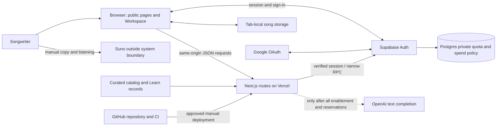
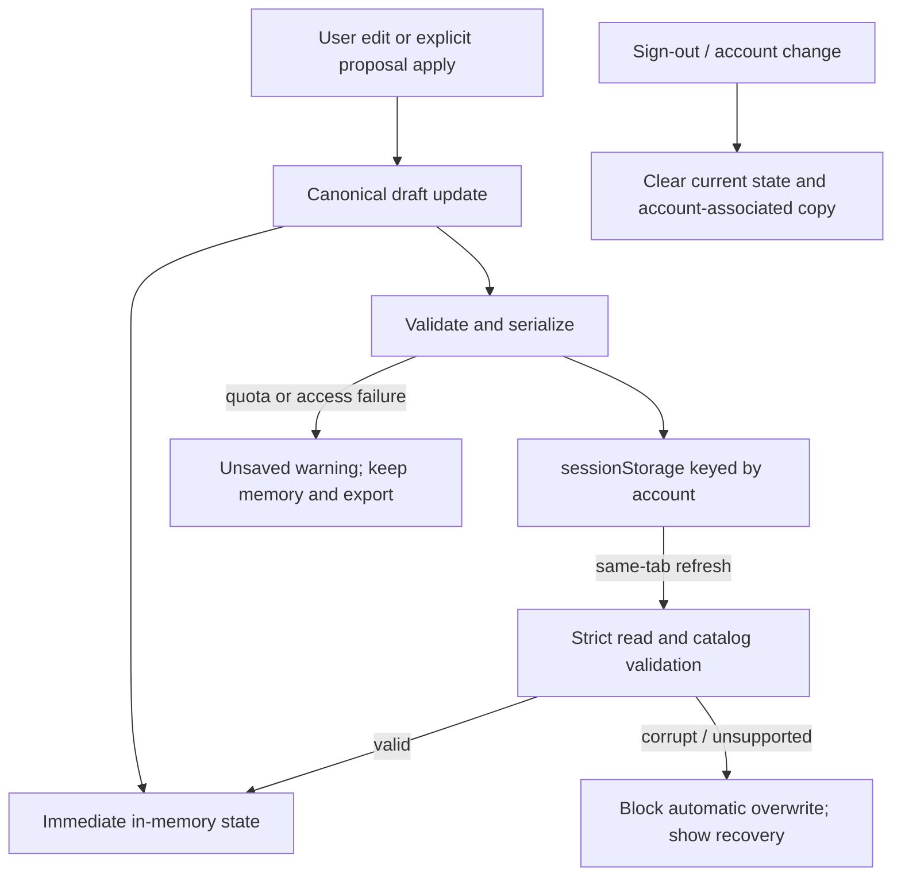
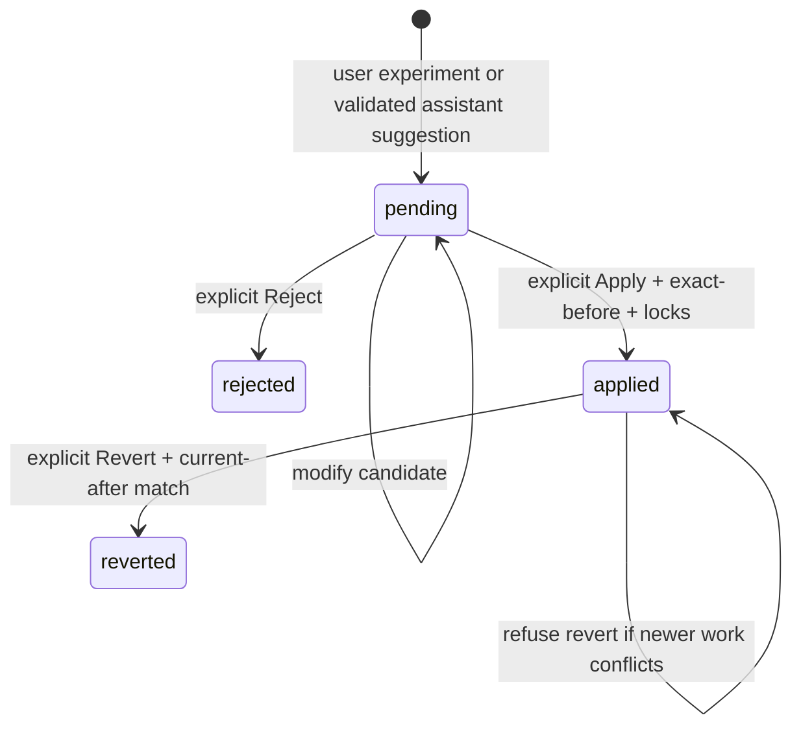

# PromptSuno System Architecture

**Document version:** 1.0 · **Evidence cutoff:** 7 October 2026, UTC  
**Audience:** engineers, technical leads, product owners and operational reviewers  
**Implementation snapshot:** `3d8ae6457a2b02c413d6275e130fae944452f549` (PR16, unreleased stack)  
**Companions:** [Developer handoff](../onboarding/Developer-Handoff.md) · [Evidence and audit index](../reference/Architecture-Evidence-Index.md)

## 1. Scope and reading conventions

This document describes the complete application at the implementation snapshot, including capabilities disabled in the hosted preview. It is an engineering description, not a production-release declaration or an authorization to enable services. Relative source links refer to that snapshot; the evidence index supplies immutable GitHub links and distinguishes inspected code, CI evidence, prior operational verification, owner reports and future plans.

The repository is `thelostquarryrocks-prog/promptsuno`. Remote main is `ef66bc08621322bf3c93c14d1e2e8f068b3d39ed`, ending with PR8. PRs 9–16 are open drafts stacked in order. Therefore checking out main does not produce the complete Workspace described here. Historical documents marked CURRENT contain dated implementation assumptions; current source establishes implemented behavior, while the approved Workspace brief establishes product intent. Existing authority files are retained unchanged.

### Current-state summary

| Area | Implementation and operational status |
|---|---|
| Public product | Homepage, five Learn guides, contextual Monkey Methods, early-access links and existing-account login |
| Creative application | One shared song with Brain, Lyrics and Doctor modes; local editing, import/export, preservation and reversible proposals |
| Persistence | Account-associated `sessionStorage` in the current tab; no cloud song database, cross-device sync or project library |
| AI | Compiler and assistance routes implemented and tested; current preview has no provider key and assistance remains disabled |
| Database | Original per-user quota migration historically applied; newer aggregate spend migration tested but not applied live or seeded |
| Google | Enabled only on the latest protected preview; owner reported successful existing-account sign-in after saving the exact callback |
| Other providers | Facebook code exists but configuration/testing is paused by the owner; Apple is outside this implementation |
| Release | Protected preview only; stack unmerged, signup closed, no production promotion |

Latest verified deployment: `dpl_8LZQyE4KkAEQ2WrtEWN1RkTP7fZE`, [protected preview](https://promptsuno-signin-staging-kklmqrd7n-prompt-suno.vercel.app), exact snapshot SHA, READY. Prior verification observed anonymous HTTP 302 to Vercel Authentication and `X-Robots-Tag: noindex`. Google success is an owner report at 03:59 UTC, not a new automated OAuth test in this documentation review. [Evidence: O1–O4](../reference/Architecture-Evidence-Index.md#operational-evidence)

## 2. Product purpose and boundaries

PromptSuno is a mobile-first creative companion for people developing songs with Suno. Its product jobs are **LEARN** (understand a technique), **BUILD** (express musical and lyrical intent), and **FIX** (respond to a result that missed the user's intention). Workspace represents the song, not a fourth tool. Brain, Lyrics and Doctor are views of the same creative state.

The intended loop is: learn a concept, select sound ideas, write relationship notes, compile editable Styles, write and structure lyrics, copy outputs to Suno, listen there, return with an observation, and try a small reversible change. The application does not call Suno, generate audio, listen to uploaded music or inspect hidden Suno processing. Doctor knows supplied text and user reports, not audio-derived facts. Core usefulness must not depend on invented upgrade gates or unlimited-AI promises. Cloud memory and premium depth are later work.

Product invariants from the [product authority](../authority/PromptSuno-Product-and-Architecture-v1.md) and approved Workspace brief:

1. Exact structured musical selections and authored notes remain authoritative; generated Styles is one editable rendering.
2. Musical contrasts and unusual combinations are allowed. Affinity is a discovery aid, never a compatibility law or numeric prompt weight.
3. Lyrics receives sound context automatically but cannot silently change it. Suggestions require an explicit application step.
4. Doctor separates observations, hypotheses and experiments. It cannot turn a reported symptom into a proven hidden cause.
5. Preservation and reversibility protect creative work. When later edits conflict with an older proposal, fail visibly instead of overwriting.
6. Keep the active tool visually dominant, with compact navigation and song context. Preserve the large orb and mobile interaction quality.
7. Never place private song text in URLs, analytics events or ordinary diagnostic logs.

## 3. System context



There is one Next.js application, not separate frontend and backend services. Server route handlers mediate paid calls. Supabase provides identity/session infrastructure and narrowly exposed quota RPCs. The application uses no service-role credential for normal requests. There is no queue, realtime collaboration channel, vector store, retrieval pipeline, billing/subscription service or background AI worker in the inspected source.

The research corpus and historical SunoV6.wiki documents are editorial inputs, not runtime databases. Tally is an external early-access destination configured in `src/lib/site.ts`; it is not an application-owned account-registration service. The user decides what to copy into Suno. [Sources: S1, S2, S8, S10](../reference/Architecture-Evidence-Index.md#source-map)

## 4. Technology baseline

Versions below are resolved in `package-lock.json`, not estimates from dependency ranges.

| Component | Version / role |
|---|---|
| Next.js | 16.3.6, App Router, server pages and route handlers; `src/proxy.ts` request boundary |
| React / React DOM | 19.2.8, client workbenches and context |
| TypeScript | 5.9.3 |
| Tailwind CSS | 4.3.3, alongside CSS modules and component CSS |
| Supabase JS / SSR | 2.117.1 / 0.12.7 |
| OpenAI SDK | 7.23.0, Chat Completions with strict JSON schema |
| PWA plugin | `@ducanh2912/next-pwa` 10.2.9, Workbox runtime policies |
| Vitest / Playwright | 4.0.18 / 1.63.0 |
| CI runtime | Node 24.12.0; isolated PostgreSQL 17 service |
| Installed graphics packages | Three.js 0.186.1, Fiber 9.8.1, Drei 10.7.9; not imported by active source at this snapshot |

**Graphics architecture correction:** earlier authority and font notes describe a Three.js scene with `useFrame` and mutable simulation refs. The accepted redesign's current `SoundBrainCanvas.tsx` renders DOM buttons, CSS animation and an image-backed orb. It uses pointer capture and React state/refs, with no Fiber Canvas or `useFrame`. `TagCollectorCanvas.tsx` is an unreferenced legacy component with mock tags. Dependencies and historical assets do not prove a current rendering dependency. Do not revive or remove that legacy system as a side effect of routine work. [Sources: S1, S4](../reference/Architecture-Evidence-Index.md#source-map)

## 5. Route and module map

| Route | Responsibility | Access / rendering |
|---|---|---|
| `/` | Product homepage; starter intent; Learn/Build/Fix entry points | Public page, interactive hero island |
| `/learn` | Guide directory | Static public HTML |
| `/learn/[slug]` | `style-prompts`, `song-structure`, `vocals`, `lyrics`, `editing` | Generated static pages; unknown slug not found |
| `/login` | Email/password and gated social actions | Public entry route, private/no-store response policy |
| `/workspace` | Server discovery projection and client shared Workspace | Authenticated, dynamic through `connection()` |
| `/api/generate` POST | Structured musical intent to Styles candidate | Route-owned verified authentication, bounded JSON, reservation |
| `/api/workspace-assist` POST | Section revision or bounded Doctor suggestions | Route-owned verified authentication, explicit availability and reservation |
| `/auth/providers` GET | Effective social availability booleans | Public settings projection, no provider secrets |
| `/auth/social` POST | Same-origin OAuth initiation | Explicit flags plus provider/signup agreement |
| `/auth/callback` GET | Supabase PKCE code exchange, fixed local redirects | No arbitrary return URL; private/no-store, no-referrer |
| `/auth/complete` | Same-tab starter ownership handoff | Verified user plus one-time local flow marker |
| `/robots.txt`, `/sitemap.xml` | Search policy and canonical public destinations | Preview blocked from indexing; public routes only in sitemap |

`Workspace.tsx` provides shared orchestration and UI shell. `WorkspaceProvider.tsx` owns the active draft and storage status. `workspace-draft.ts` defines/validates persisted state. `workspace-revisions.ts` enforces updates, locks and reversible changes. `workspace-assistance.ts` defines the projected AI contract. `SoundBrainCanvas`, `LyricsStudio`, `PromptDoctor`, `WorkspaceAssistance` and `ProposalReview` are consumers, not competing stores.

Brain is dynamically imported without SSR; Lyrics and Doctor are lazy-loaded under Suspense. Selected nodes, notes, outputs and active mode survive mode changes because the provider outlives individual workbenches. UI-local input, focus, drag coordinates and transient request observations need not survive unmount. [Sources: S2–S7](../reference/Architecture-Evidence-Index.md#source-map)

## 6. Shared state and persistence

### 6.1 Canonical contract

`WorkspaceDraftV1` contains the following fields. A single versioned object is deliberately smaller than the future full Song Intent system.

| Field | Content and authority |
|---|---|
| `version` | Exactly `1` |
| `project` | UUID, title, creation/update timestamps |
| `mode` | `brain`, `lyrics` or `doctor` |
| `styleIntent.selectedNodes` | Exact `{node_id, label, category}` catalog records, unique by ID |
| `styleIntent.relationshipNotes` | Authored roles, hierarchy, section scope and requirements |
| `styleIntent.compiledStyles` | Editable output; may differ from the last compiler candidate |
| `styleIntent.compilerResult` | Validated structured compiler response or null |
| `lyrics` | Ordered sections `{id,title,text}`, derived joined text, independent writing notes |
| `preservationGoals` | Section locks, exact phrases, or semantic/story notes |
| `doctor` | Reported problem, selected symptom, hypotheses, bounded proposal list |
| `revisions` | Applied proposal before/after records, plus prior compiler state for note changes |

Selected records are checked against the catalog when reopening a saved draft. Strict parsers reject malformed types, extra fields, duplicate identities, inconsistent revision relationships and unsupported versions. Existing empty V1 arrays remain valid; there is no general schema migration engine. Draft length is capped at 1,000,000 JavaScript string units; most text fields at 64,000, title at 160, sections at 100, preservation goals at 200, proposals/revisions at 20 each. These are application bounds, not Suno limits. AI accepts narrower contexts than local editing, so a valid large draft can exceed assistance limits.

### 6.2 Storage semantics



The key is `promptsuno:workspace:v1:<encoded owner>`. Owner identity labels storage; it never authorizes server access. The provider persists synchronously after shared updates, with no database call and no debounce layer. This keeps implementation simple but makes serialization cost a future performance concern for maximum-sized drafts.

This is **tab-local autosave**, not durable browser-wide storage. Refresh in the same tab is supported. Closing a tab, clearing browser storage, session expiry handling or signing out may lose the local song; exported files are the user's portable copies. Storage is not encrypted and same-origin script compromise could expose it. Multiple tabs do not synchronize active songs. A new tab may inherit a browser-provided initial session-storage copy, but subsequent edits are independent; this is not collaborative editing.

On corrupt/unavailable storage, autosave cannot silently replace the unreadable record. The UI explains recovery and offers export, retry, or explicit replacement. If early edits race with discovery of an existing saved copy, the provider blocks replacement and asks the user to preserve/export the current work. Successful sign-out and account-change callbacks reset the provider, pending starter and UI identity. Storage removal can fail in restricted browsers; isolation also relies on separate owner keys and clearing in-memory state.

The song backup is downloadable JSON. **There is no implemented JSON backup restore/import UI** at this snapshot; existing-lyrics import is separate. Do not promise that exporting a backup provides a tested round-trip project restore. [Source: S3](../reference/Architecture-Evidence-Index.md#source-map)

### 6.3 Entry and starter handoff

The homepage accepts a short starter, optionally with approved example directions. A separate session-storage envelope expires after 30 minutes and is consumed once. It carries no creative text in query parameters or cookies. Anonymous text can become account-owned only following an explicit successful login in that tab; an already-owned starter cannot be reassigned to another account. Existing song intent wins over a pending starter. The starter becomes relationship notes, not fabricated catalog identities.

OAuth uses a separate ten-minute random flow marker and HTTP-only correlation cookie. The marker itself is not an authentication credential or song content. Password login and OAuth converge on the same ownership rule. [Source: S8](../reference/Architecture-Evidence-Index.md#source-map)

## 7. Sound Brain and product data

The canonical catalog contains **899 terms across ten categories**: Genre, Mood, Instrument, Vocal, Rhythm, Texture, Production, Structure, Energy and Era. Category case and exact label are part of accepted records. Persisting a slug derived from a label, lowercasing categories or translating labels in API payloads breaks identity validation.

`sound-brain-catalog.ts` runs on the server. It loads the catalog and matrix, orders familiar opening IDs first, then includes all unchanged catalog records. The browser receives an explicit node projection and sparse ID-indexed affinity map; provenance, aliases and other raw catalog metadata stay outside that projection. Missing affinities use `0.20`; explicit matrix relationships are addressed using catalog labels and projected into stable node-ID pairs. No matrix values go to the compiler.

The active scene provides live category filtering, rotating visible ideas, pointer drag-to-orb, tap/click collection, explicit remove controls, and a paginated non-drag list. Speed, Density and Connection change presentation/discovery only. Related highlighting uses the affinity map during a drag. Category changes requested mid-drag wait until completion; cancellation/lost capture does not collect accidentally. Reduced-motion support, hover/focus pause and compact layouts reduce motion and input friction. The current architecture uses the shared provider for selection, never the DOM position of a node as canonical state.

Node/notes edits invalidate old compiler output through Workspace handlers. Editing the generated Styles field does not rewrite selections or notes. API orchestration stays outside the canvas component. [Sources: S4, S5](../reference/Architecture-Evidence-Index.md#source-map)

## 8. Lyrics and Doctor lifecycle

Lyrics Studio is a section editor: add, rename, reorder, remove, import, write notes, preserve, copy and export. Import recognizes bracketed section labels only where splitting and rejoining with the canonical two-newline separator retains the original text. Labels remain inside imported text. Section titles are organizational metadata; export joins section text without inventing performance commands.

Section locks mechanically protect title/text/deletion. Phrase preservation mechanically prevents reducing existing exact occurrences in the joined lyrics. Case, whitespace and punctuation matter. A locked section can still be repositioned because ordering is not included in its text/title lock. Story/meaning notes guide humans and model instructions; they are not semantic proofs. A proposal's modified candidate is rechecked at apply time, so editing the proposal textarea cannot bypass preservation.

Doctor begins with one of eight symptom categories and a report of what was heard versus desired. It displays existing sound and lyric context, links directly to selected Brain ideas and lyric sections, and can create user-authored experiments while AI is unavailable. It has no hidden-rule engine and does not infer deterministic causes from regexes. Model observations are displayed for the current request; hypotheses and proposals persist in the draft. Observations are not a durable audit log, and the assistance projection does not currently include full prior revision history.



Proposals target only relationship notes, compiled Styles, or an existing lyric section. They cannot add/delete catalog nodes, change an account or replace an entire project. At apply, current text must exactly equal `before`; a revision captures before/after. At revert, current text must exactly equal the applied `after`. Note changes clear compiler output; reverting them restores prior compiler state only if no later compilation or incompatible selection would be overwritten. Histories stop accepting new entries at their bounds instead of silently evicting old records. This is limited reversible experimentation, not arbitrary undo for every keystroke or branchable version control. [Sources: S3, S6, S7](../reference/Architecture-Evidence-Index.md#source-map)

## 9. AI contracts and trust boundaries

### 9.1 Compiler

`POST /api/generate` accepts exactly `nodes` and `relationship_notes`. It requires at least one selected catalog term, rejects duplicates/altered labels/categories, limits actual streamed body bytes to 256 KiB, and limits notes to 16 KiB UTF-8. It requires JSON and rejects cross-origin browser requests using the actual Host convention, not arbitrary forwarded-host values. Originless non-browser requests still require a verified cookie session.

The server verifies identity with `supabase.auth.getUser()` before request processing or model-client creation. A missing key returns unavailable. An accepted provider request must then pass the aggregate and per-user reservation. The fixed model constant is `gpt-5.6-luna`, output cap 2048, SDK timeout 30 seconds, automatic retries zero. The exact configured model string is repository evidence, not a fresh assertion about public availability or current price.

Output contract version `1.0.0` has `status`, `styles`, `coverage`, `interpretations`, and `questions`. A `ready` result requires nonempty Styles, every selected ID exactly once as preserved, no questions, and at most three interpretations. `needs_clarification` requires empty Styles and one or two questions. Schema validation establishes shape and declared coverage; it does not prove the prose semantically honors every concept. User review remains necessary.

Prompts instruct the writer to preserve roles and contrasts, avoid invented instruments/tempo/key/meter, and avoid inferring no-vocals from an instrument-only palette. All user strings remain untrusted for non-musical instructions. There are no tools or audio inputs. Some historical prompt wording mentions anchors/contrast policy, but these are not exposed fields in the current two-field input contract.

### 9.2 Assistance

`POST /api/workspace-assist` projects action, exact nodes, notes, Styles, sections, lyric notes, preservation goals, reported problem/symptom, target section and instruction. It omits account/project identifiers, storage metadata and revision history. Actual request bytes are limited to 64 KiB, general request strings to 16,000 characters, sections to 100 and preservation goals to 200.

Lyrics requests need an existing unlocked target section. Doctor requests need a nonblank observed-problem report. The response contains at most six observations, six hypotheses and three proposals; `before` must match the request exactly, targets must exist and be distinct, and proposed text must pass preservation checks. Lyrics action can propose changes only to its chosen section. Doctor can target the three supported text surfaces. Instructions distinguish authored musical authority from untrusted instructions about billing, accounts, tools or system prompts.

The UI requires `WORKSPACE_ASSIST_ENABLED=true` and a key to expose active assistance. The route additionally relies on `AI_SPEND_ENABLED` and the database policy. Thus a visible assistance control is not proof that budget availability has been established. The current preview leaves assistance unavailable and allows manual editing/experiments.

### 9.3 Race and failure behavior

Compilation prevents duplicate submissions and checks account revision, project ID, exact intent and intervening output before accepting a result. Assistance has an AbortController plus exact immutable draft/mode/project/request checks; switching away and back or editing then undoing still invalidates an in-flight suggestion. Browser cancellation does not guarantee the remote call stopped and never earns a refund.

| Status | Meaning at application boundary |
|---|---|
| 400 | Malformed/invalid intent, target, preservation constraint or missing relevant context |
| 401 | Missing/invalid verified account session |
| 403 | Cross-origin request rejected |
| 413 / 415 | Body limit / unsupported media type |
| 429 | Per-user quota denial with retry information |
| 503 | Disabled/keyless state, auth/config/reservation failure or aggregate pause |
| 502 | Provider failure or invalid structured model response |

Provider failure after reservation retains usage. Errors are generic and avoid exposing creative payloads or credentials; the compiler logs a fixed failure message. No text-only test establishes Suno audio quality or model-wide reliability. [Sources: S5, S7, S9](../reference/Architecture-Evidence-Index.md#source-map)

## 10. Authentication, authorization and OAuth

The browser uses the Supabase client; server handlers use the SSR client and cookie store. Middleware refreshes protected page sessions and redirects unauthenticated Workspace access to login. Paid routes bypass that middleware refresh path and own their verification/JSON failures to avoid duplicate refresh or HTML redirects. Browser `getSession()` is used for local ownership only, not server authorization.

Supabase session cookies are intentionally browser-readable (`httpOnly:false`) for the SSR/browser client architecture, with path `/`, SameSite Lax and HTTPS Secure handling. Do not describe every auth cookie as HTTP-only. The extra OAuth correlation cookie is HTTP-only, scoped to `/auth`, and expires after ten minutes. This distinction means prevention of script injection and control of third-party scripts remain important.

Social availability requires a server flag and the public Supabase provider setting to agree, including exact agreement on closed/open signup. Settings fetches have a five-second timeout and fail closed. `/auth/social` is a same-origin bounded 1024-byte JSON POST. It validates provider, intent and flow, and only returns an authorization URL on the expected Supabase origin/path. The callback exchanges the code through SSR and ignores arbitrary destination parameters. Cancellation/expired-code failures map to generic login states; handoff-cookie clearing uses the same mutable cookie store as session writes.

```mermaid
sequenceDiagram
  participant B as Browser (same tab)
  participant N as PromptSuno
  participant A as Supabase Auth
  participant G as Google
  B->>N: POST /auth/social (provider, flow, signin)
  N->>A: Check public provider settings; create PKCE flow
  N-->>B: Supabase authorize URL + correlation cookie
  B->>G: Provider authorization via Supabase
  G->>A: Provider callback
  A->>N: Code to exact /auth/callback
  N->>A: Exchange code for session
  N-->>B: Fixed /auth/complete?flow=... or /workspace
  B->>N: Verify user; consume same-tab marker
  B->>B: Bind eligible starter; remove flow from URL
```

There are two distinct redirects: provider → `https://mtzrvekmsmpflbsqgpcc.supabase.co/auth/v1/callback`, and Supabase → the exact PromptSuno preview `/auth/callback`. The application cannot inspect the Supabase redirect allowlist through public settings. Consequently a Google button can enable before its callback is correctly allowlisted. Owner configuration/normal-browser verification is part of readiness. Provider secrets belong only in the owner's provider/Supabase dashboards, never Vercel client variables or repository files. [Source: S8; provider setup reference](https://supabase.com/docs/guides/auth/social-login/auth-google)

## 11. Database and spend protection

No application song, lyrics, revision, subscription or project tables exist in the checked-in migrations. Supabase's managed Auth schema is an external dependency; this repository does not define it.

| Object | Role | Grants / retention |
|---|---|---|
| `compiler_quota_private.policy` | Singleton burst and sustained limits/windows | Private schema, RLS, no application table access |
| `compiler_quota_private.usage` | One counter row per Auth user | User FK cascades on deletion; no prompt text or attempt log |
| `public.reserve_compiler_attempt()` | Reserve both per-user counters atomically | Authenticated execute only; identity from `auth.uid()` |
| `compiler_quota_private.ai_spend_policy` | Disabled-by-default singleton model, verified pricing/expiry, daily/lifetime ceilings and reservations | New migration; private RLS; no client mutation; aggregate survives user deletion |
| `public.reserve_ai_attempt(requested_action text)` | Shared reservation for `compile` or `assist` | Authenticated execute only; no caller-supplied identity, price, time or token counts |

Both SQL functions are narrow SECURITY DEFINER entry points with empty `search_path`, explicit grants and a three-second lock timeout. Private schema/table rights and default public function rights are revoked; RLS has no application policies because callers should use only the RPC. The original function locks policy then the user's counter, samples time after locking and uses fixed epoch-aligned windows. The historically configured policy is three attempts per 60 seconds and twenty per 86,400 seconds; these are operator values, not a Free plan promise or a sliding-window implementation.

The new function first locks the aggregate singleton across all users/actions, validates enabled/unexpired pricing and ceilings, calls the existing per-user function in the same transaction, then increments aggregate usage. Denial consumes neither new reservation; exceptions roll back both. Lost-response/unknown-outcome calls are not retried or refunded. Authenticated callers can invoke the RPC directly and consume bounded allowance without a provider call, a possible bounded denial-of-service concern; they cannot cause this application's provider route to skip a reservation.

Each request reserves integer micro-USD using:

`ceil((131072 × input_microusd_per_million + 2048 × output_microusd_per_million) / 1000000)`

The server permits only the fixed model, text messages, one bounded completion and a 96 KiB serialized provider envelope including instructions/schema. It rejects unexpected provider parameters. The 131072 input allowance is a conservative contract assumption, not tokenizer measurement. Before activation, an operator must verify model availability, rates, reasoning/schema billing and the relationship between byte bounds and tokens. The application ceiling covers its own reservations, not requests made elsewhere or unconditional provider invoices.

The original migration `202609280001_compiler_quota.sql` has prior applied/accepted staging evidence. `20261007022852_aggregate_ai_spend_guard.sql` is **not applied live and contains no policy seed**. Its SHA-256 is `41e3f26dd735424b77d61668c0e3a632f860782335191a19bafc65edc936075e`. New live migration, seed values, enablement, provider credential and paid calls each remain separately controlled operational actions. [Source: S9](../reference/Architecture-Evidence-Index.md#source-map)

Current official OpenAI documentation offers optional organization/project hard-limit enforcement, distinct from alerts; enforcement can lag and recorded spend can exceed the configured threshold slightly. Whether enforcement is enabled for this account was not verified in this review. Historical “$10 hard cap” statements are not sufficient proof of present provider enforcement. [OpenAI spend limits, checked 7 October 2026](https://developers.openai.com/api/docs/guides/spend-limits)

## 12. Learn, evidence, SEO and assets

Five typed Learn records are built into static HTML. Discriminated blocks support fast answers, explanations, workflows, examples, comparisons, caveats, mistakes, advanced considerations and Monkey Methods. Records include related guides, source notes and Build/Fix actions. `LearnSource` currently distinguishes official/research; it does not implement the complete future evidence-class/confidence taxonomy. Editorial copy must still distinguish documented features, reports, recommendations and inference.

The runtime does not ingest raw research PDFs or a knowledge-base corpus. The authority manifest names these resources for editorial reference but they are not checked-in runtime assets. Adding retrieval or automated evidence evaluation would be new architecture. Public claims require a directly supporting source; absence of an experiment means no claimed measured result.

Monkey Methods are optional client islands. Static methods record opened state; rotating methods keep seen indexes in localStorage and cycle only after exhaustion. Workspace hints persist boolean dismissal preferences. These stores contain no song content and do not trigger database writes. The homepage has its own optional banana-tip interaction.

Indexability is allowed only when `VERCEL_ENV === 'production'` and the path is `/`, `/learn`, or a guide path. Root metadata defaults private; page metadata applies public overrides. Preview robots disallow all; private routes always receive noindex. Sitemap URLs use `SITE_URL` (default `https://promptsuno.com`) and include public destinations only. This is index policy, not proof of DNS mapping or production launch. Current Learn CTAs route existing users to login and other users to early access; rich contextual Learn→Workspace handoff is still incomplete. The older `docs/learn.md` URL-context instruction must not be used for private text.

Brand imagery is local WebP under `public/images/design`; Google sign-in uses the unchanged approved PNG under `/brand` with attribution. Local Geist font/license files remain from the earlier scene, while root layout currently uses `next/font/google` for Geist/Geist Mono; a clean build can therefore require font download access. A complete rights/provenance manifest for the design image set was not found. Legacy wordmarks and historical product routes must not be revived automatically. [Sources: S10, S11](../reference/Architecture-Evidence-Index.md#source-map)

## 13. Caching, deployment and observability

Protected Workspace, login, auth and AI routes receive `Cache-Control: private, no-store`. Workbox uses NetworkOnly for matching same-origin GETs; blanket navigation caching is disabled because it cannot exclude authenticated pages. Public assets may use normal caching. PWA support does not make authenticated work or AI available offline. Generated worker files are excluded from Git/lint. Some browser fixtures deliberately suppress service workers, so cache unit/browser checks are not full offline-PWA acceptance.

GitHub Actions runs on PRs and main pushes. It pins actions, uses locked npm installation, Node 24.12.0 and no deployment/provider secrets. One job performs lint, type generation, unit tests, webpack build and Chromium/WebKit browser checks. A second runs real SQL on disposable PostgreSQL 17 with an Auth-subject shim; it is not a live Supabase JWT/PostgREST test. Artifacts retain database receipts and responsive/failure evidence for seven days.

The implementation SHA's completed CI run passed **319 unit/API/component tests, 110 browser tests with seven existing skips, and 30 database checks**. Build and typecheck passed; lint had zero errors and two existing warnings. Browser devices are desktop Chromium, Pixel 7 emulation and iPhone 13 WebKit emulation. These are not physical-device or real-keyboard acceptance. Prior owner-guided live AI work used twelve authorized submissions and closed with the temporary key revoked; its narrow sample acceptance is not general model or Suno-audio validation. [Evidence: T1, O3](../reference/Architecture-Evidence-Index.md#verification-evidence)

Deployments are manual CLI actions from clean exact-SHA detached worktrees. No Git integration is connected in the verified staging configuration; a merge does not deploy. The named project is `promptsuno-signin-staging`, `prj_3MzWlBvUpiOPkBtBMbkL2rKh6ZcU`, team `prompt-suno`. Two public Supabase settings require in-memory per-deploy build/runtime overrides under the existing procedure; do not silently change their project targets. The latest preview adds only runtime `SOCIAL_AUTH_GOOGLE_ENABLED=true`. The stable staging alias was previously found pointing to older code and is not evidence of the current build.

**Verification hazard:** Vercel CLI 62.4.0 `vercel curl <full protected URL>` silently created a persistent project protection-bypass token during a prior check. It was revoked and zero remaining tokens plus all-deployment protection were verified. Future checks must use anonymous requests, read-only deployment metadata or the owner's normal browser, unless credential creation is explicitly approved at action time.

There is no application-owned telemetry pipeline, distributed tracing, content analytics or error-monitoring SDK in inspected source. CI and platform build/status logs provide operational evidence; generic runtime errors provide limited diagnosis. A future observability design should add metadata-only signals, retention/access rules and redaction without collecting lyrics/prompts. Platform default logs/retention were not audited here. [Source: S12](../reference/Architecture-Evidence-Index.md#source-map)

## 14. Decisions, tradeoffs and risks

| Decision | Benefit | Cost / consequence |
|---|---|---|
| One context provider and strict V1 object | Clear cross-tool source of truth; easy local reasoning | Large synchronous serialization; no durable cloud recovery |
| Tab-local storage | Refresh continuity without competing tab writers | Closing/logout is not durable save; no cross-device access |
| Generated Styles separate from intent | Keeps exact selected meaning available | Output can become stale; invalidation must remain explicit |
| Bounded text proposals with exact before/after | Prevents silent stale overwrite and enables safe revert | No automatic merge, arbitrary undo, node-edit proposals or variant graph |
| Mechanical section/phrase locks | Deterministic textual preservation | Meaning/roles still need review; literal counts are not semantics |
| Server-only AI with atomic reservation | Consistent auth/cost boundary across tools/users | Global row can serialize throughput; no refund may reject useful retries |
| Curated static Learn content | Crawlable, lightweight, auditable education | Editorial upkeep; no runtime research retrieval |
| Closed signup and protected keyless preview | Controlled acceptance while economics/config mature | Hosted AI controls unavailable; not public product readiness |

Highest-priority remaining risks are accidental activation from stale operational docs, local-song loss misunderstood as durable saving, semantic AI drift despite valid JSON, a long unmerged stack, incomplete physical-device/OAuth/PWA coverage, and lack of production monitoring/incident ownership. Catalog projection computation loops over term pairs on each dynamic Workspace request; growth beyond the current catalog warrants measurement before caching or redesign. No performance SLO or load-test evidence is established.

## 15. Roadmap and explicit non-goals

The implemented core loop is available for manual use, with AI infrastructure gated. Next work should reconcile documentation pointers, review/merge the stack under owner authorization, improve backup recovery and real-device acceptance, and establish measurable operational readiness. Any live AI activation needs verified economics and the unapplied spend migration process. Facebook remains paused; Apple is not scheduled by this document.

Later product work may add cloud projects, deliberate sync, deeper history, variants/comparison, richer targeted editing and sustainable tier allowances. These need identity/RLS/retention/conflict designs before a schema is created. There is no approved final database design for them. Audio diagnosis, direct Suno integration, autonomous song rewriting, payment integration, project sharing and guaranteed Suno controls are not implemented and must not be presented as current capabilities.

For exact onboarding steps, environment inventory, rollback boundaries, common change locations and prioritized work, use the [Developer handoff](../onboarding/Developer-Handoff.md). For evidence qualifications and contradictions, use the [audit index](../reference/Architecture-Evidence-Index.md).
